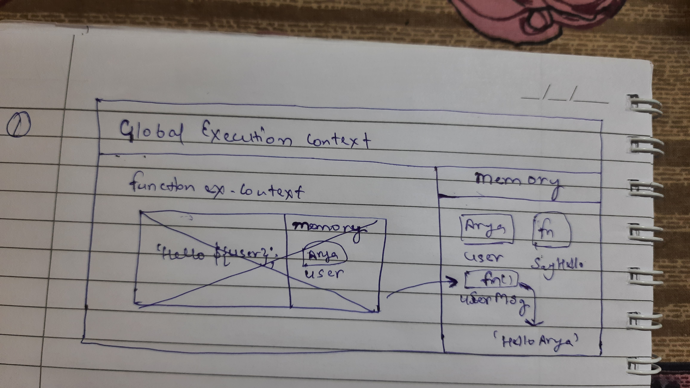
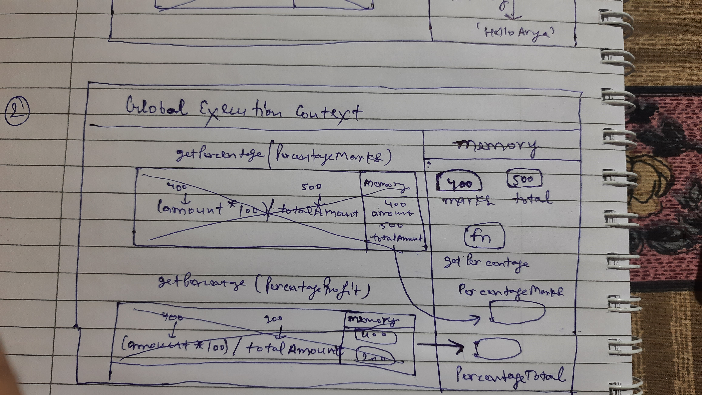
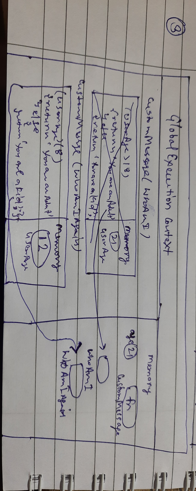

1. What does thread of execution means in JavaScript?

The thread of execution in javascript means the how the js engine reads our code as js is a single threaded language the code is read line by line and for every line various things happen like creation of execution context, scope chaining, hoisting of variables and functions, etc.

2. Where the JavaScript code gets executed?

The javasript code gets executed in the js engine.

3. What does context means in Global Execution Context?

The context in global execution context means which code blocks do we have access to in our code from the current code block.

4. When do you create a global execution context.

The global execution context gets created on its own even before we write the first line of our code.

5. Execution context consists of what all things?

It consists of information about all the variables, functions, objects, etc. that are present in the code plus the javascript's default properties and methods in case of global context. In case of funciton context it holds every variable or nested functions etc. that it contains.

6. What are the different types of execution context?

The execution context are of two types on is the global execution context and the other is the function execution context.

7. When global and function execution context gets created?

global gets created by default as we start our code and function execution context gets created when the js engine encounters a function in our code.

8. Function execution gets created during function execution or while declaring a function.

It get created when the function is executed.

9. Create a execution context diagram of the following code on your notebook. Take a screenshot/photo and store it in the folder named `img`. Use `` to display it here.


```js
var user = "Arya";

function sayHello(){
  return `Hello ${user}`;
}

var userMsg = sayHello(user);
```

<!-- Put your image here -->




```js
var marks = 400;
var total = 500;

function getPercentage(amount, totalAmount){
  return (amount * 100) / totalAmount;
}

var percentageMarks = getPercentage(marks, total);
var percentageProfit = getPercentage(400, 200);
```

<!-- Put your image here -->




```js
var age = 21;

function customeMessage(userAge){
  if(userAge > 18){
    return `You are an adult`;
  }else {
    return `You are a kid`;
  }
}

var whoAmI = customeMessage(age);
var whoAmIAgain = customeMessage(12);
```

<!-- Put your image here -->


