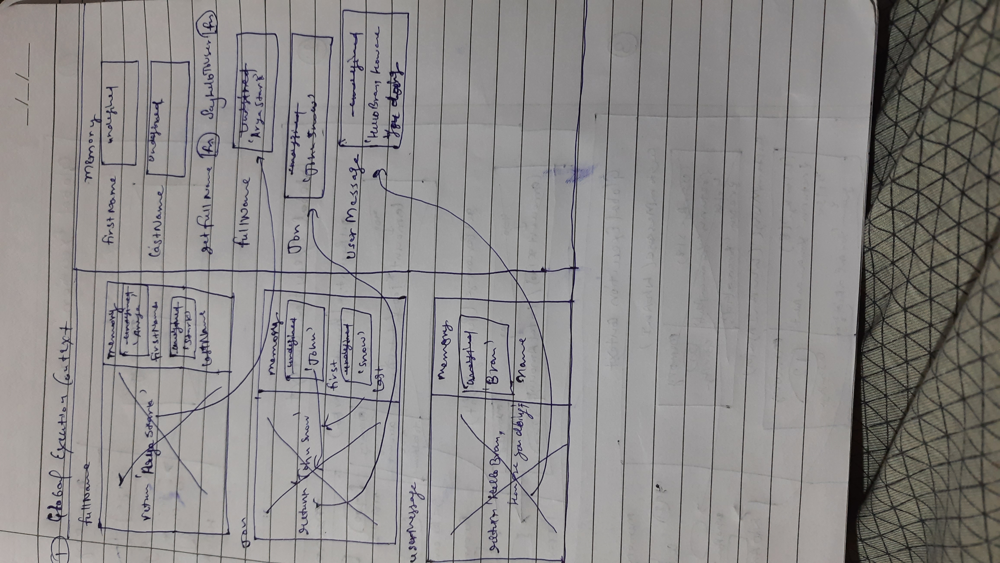
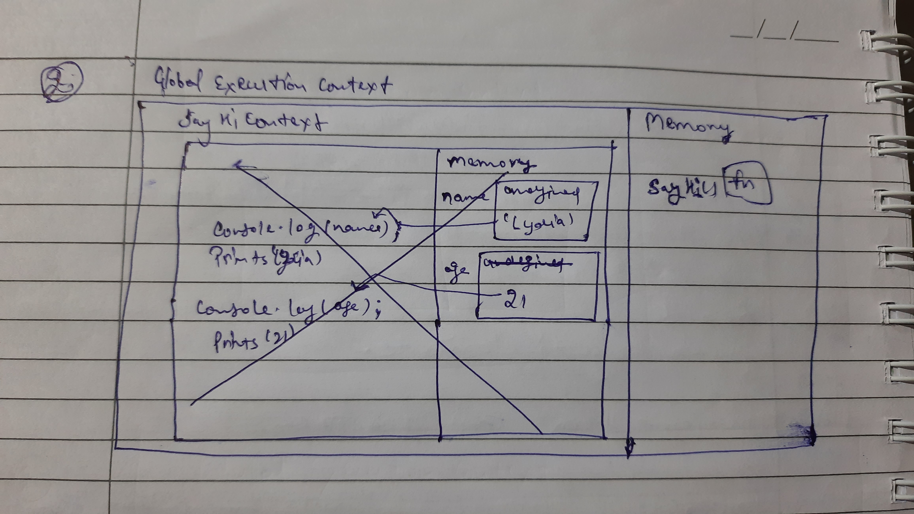
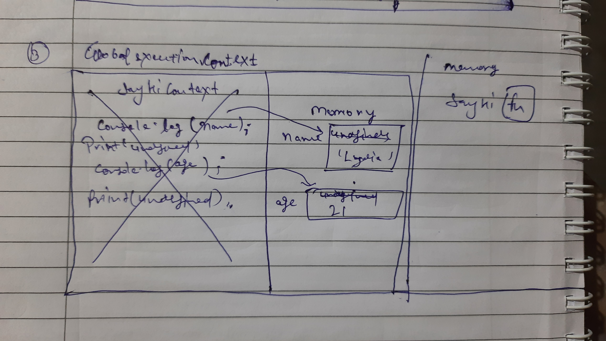

Create a execution context diagram of the following code on your notebook. Take a screenshot/photo and store it in the folder named `img`. Use `` to display it here.

- Take in account the different phases of execution, different execution contexts

1.

```js
var firstName = 'Arya';
var lastName = 'Stark';

function getFullName(first, last) {
  return `${first} ${last}`;
}

function sayHelloToUser(name) {
  return `Hello ${name}, How are you doing?`;
}

var fullName = getFullName(firstName, lastName);
var jon = getFullName('John', 'Snow');

console.log(fullName);

var userMessage = sayHelloToUser('Bran');
```

<!-- Put your image below -->



2.

```js
function sayHi() {
  var name = 'Lydia';
  var age = 21;
  console.log(name);
  console.log(age);
}

sayHi();
```

<!-- Put your image below -->



3.

```js
function sayHi() {
  console.log(name);
  console.log(age);
  var name = 'Lydia';
  var age = 21;
}

sayHi();
```

<!-- Put your image below -->



4.

```js
console.log(arr); // undefined
console.log(username); // undefined
var usename = 'Sam';
var arr = [1, 2, 3, 4, 5, 6];

function double(num) {
  return num * 2;
}
```
