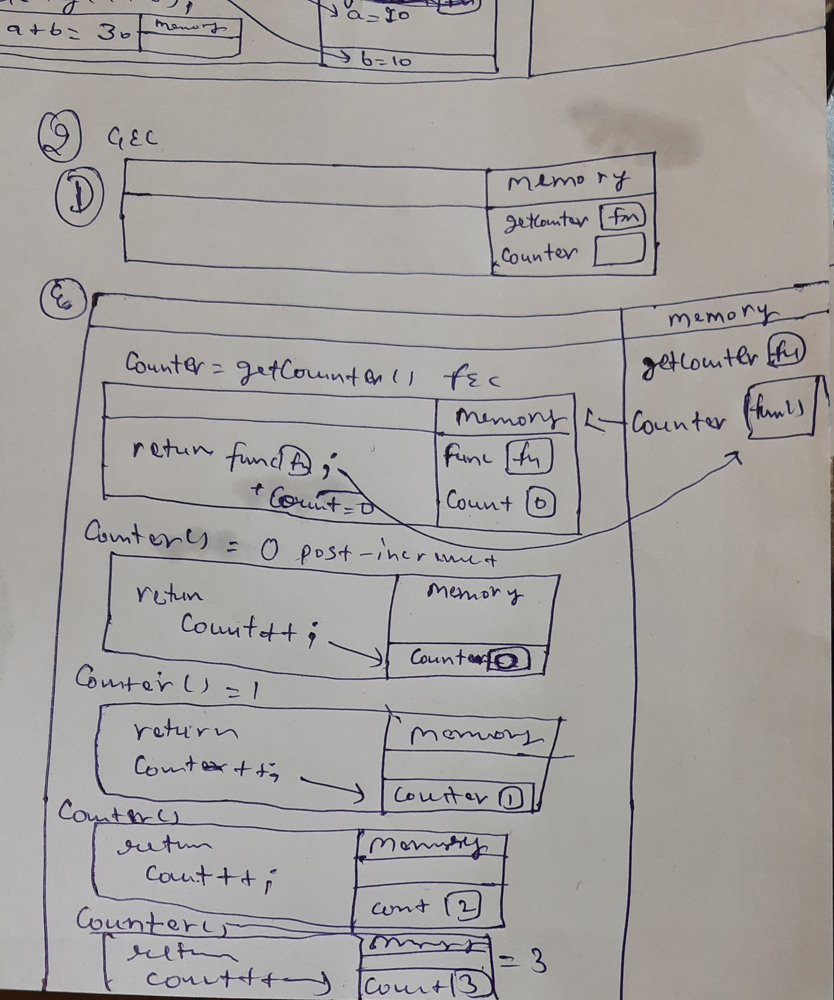
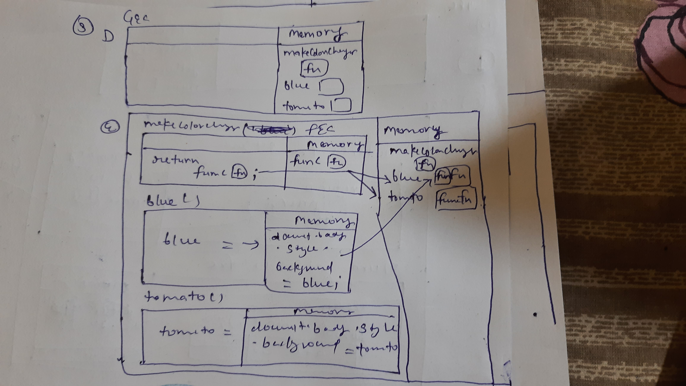

Create the execution context diagram for the following code snippets:

```js
function outer() {
  let b = 10;
  function inner() {
    let a = 20;
    console.log(a + b);
  }
  return inner;
}
let getSum = outer();
let num = getSum();
```

2.

Create the execution context diagram for following code. Also write the output of the code below.

```js
function getCounter() {
  let count = 0;

  return () => {
    return count++;
  };
}

let counter = getCounter();

counter(); // 0
counter(); // 1
counter(); // 2
counter(); // 3
```

3. Create the execution context diagram

```js
function makeColorChanger(color) {
  return function () {
    document.body.style.backgroundColor = color;
  };
}

let blue = makeColorChanger('blue');
let tomato = makeColorChanger('tomato');

blue();
tomato();

// What will be the background color after the execution of last line
```




